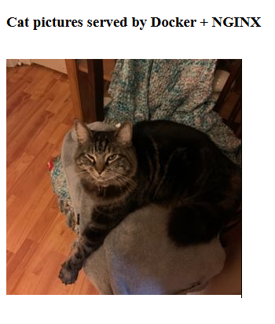

#### Task description
Create a custom nginx image based on the official Alpine image that serves a static page on localhost:8080. The container should be accessible by an unpriviliged user. That means, an image should also create an additional user with sufficient permissions for specific files used by nginx. For the sake of demonstration the static page would display a random image of a cat:



#### QA
> What is Alpine and what does its Docker image mean specifically?
* Alpine is a lightweight Linux distro. Alpine Docker boots up an isolated Alpine environment that is almost identical to the one installed on a separate machine. There are many other images similar to this one, however it has its own merits: it's **lightweight**, it gives **access to APK command** that installs additional software (like a package manager) and it's fully **open source**.

> Why do we need to create a separate user?
* Nginx requires special permissions, either reading its config files or writing into logs. Although we can explicitly define root access in our Dockerfile, it [isn't considered to be the best practice](https://www.docker.com/blog/understanding-the-docker-user-instruction/). Therefore we define a user and a group with no-root permissions and use it to set up our Docker image.

> How to start the container?
* Enter the parent directory with `docker-compose.yml` and run the following command:
    ```
    docker-compose up -d --build
    ```
    Then the static file should be available at: `http://localhost:8080/` 