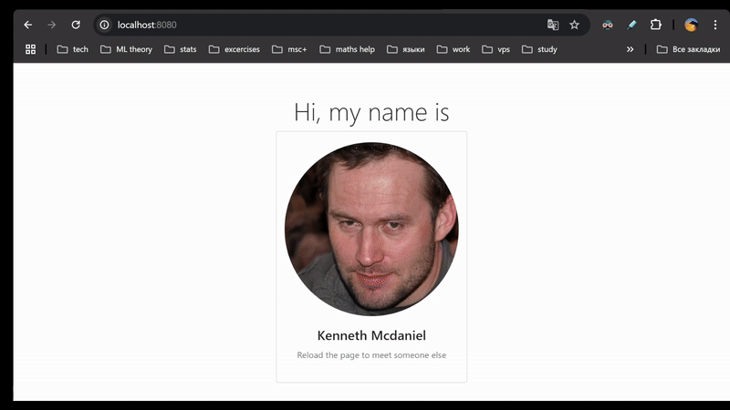

### Task description
Create a docker app that connects to an arbitrary database. The project should use lightweight alpine images, run under unprivileged user and support automatic db migrations. 

### Project's description
The project generates random people with their personal unique avatar and saves them inside `names` table of the `mipt_db` database:

### Generation pipeline
To view generated people follow these steps:
1. Start the container: `docker-compose up --build`
2. Open this url enough times (or make enough GET requests to it): `http://localhost:8080/gen_user`. Each new request generates a random unique person.
3. View results of generations on: `http://localhost:8080/`

### Documentation 
A more detailed information on other endpoints and their respective parameters can be found on: `http://localhost:8080/docs`

