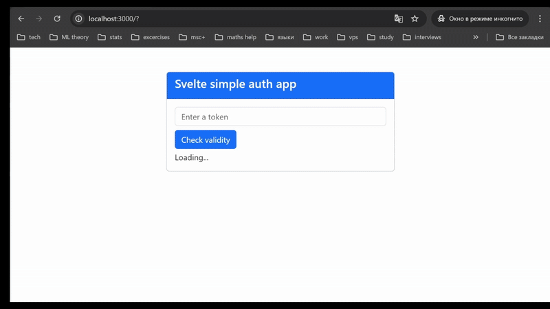

#### Task description
Create a multi-staging docker app that includes a client side as well as the server side. Running under unprivileged user as well as cache clearing are required.

#### Project description
The project contains a form that accepts a string-token, which is matched with the `SECRET_TOKEN` from the `.env` file inside the middleware of the `api/protected` GET-endpoint. 

#### How to boot up the project
1. Build the container with `docker-compose up --build`
2. Project's interface is then going to be available at http://localhost:3000/

#### Demo:
